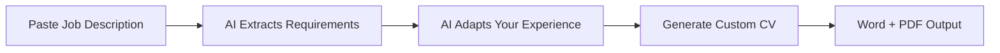

Hey

python3 -m venv my-venv   
my-venv/bin/pip command

# AI-Powered CV Customizer

Automatically customize your CV for any job posting using AI. Just paste the entire job description, and get a perfectly tailored CV in seconds.

## 🚀 Quick Start

1. **Install dependencies**:
   ```bash
   pip install anthropic python-docx
   ```

2. **Get Claude API key** from [Anthropic Console](https://console.anthropic.com/)

3. **Set environment variable**:
   ```bash
   # Mac/Linux
   export CLAUDE_API_KEY="your_api_key_here"
   
   # Windows
   set CLAUDE_API_KEY=your_api_key_here
   ```

4. **Run the app**:
   ```bash
   python main.py
   ```

## 📁 File Structure

```
cv-customizer/
├── main.py                    # Main application
├── job_parser.py             # AI job description parser
├── experience_adapter.py     # AI experience adapter  
├── cv_customizer.py          # CV template engine
├── template.docx             # Your CV template with placeholders
├── orig.docx                 # Your original CV for reference
├── project_context.json      # Additional project details (optional)
├── input.json                # Job description input file
└── outputs/                  # Generated CVs (auto-created)
```

## 🔧 Setup

### 1. Create Your Template (template.docx)

Your template should contain these placeholders:
- `{{bio}}` - Professional summary
- `{{t.skills}}` - T. Rowe Price tech stack
- `{{t.bp1}}` through `{{t.bp4}}` - T. Rowe Price bullet points
- `{{a.skills}}` - AWS tech stack  
- `{{a.bp1}}` through `{{a.bp3}}` - AWS bullet points

### 2. Provide Original CV (orig.docx)

Place your current CV as `orig.docx` - the AI will extract your experience from this.

### 3. Create input.json

The first time you run `python main.py`, it will create a sample `input.json`:

```json
{
  "job_description": "Paste the entire job posting here..."
}
```

Just replace the content with any job description and run again.

### 4. Add Project Context (Optional)

Create `project_context.json` with additional details about your projects:

```json
{
  "t_rowe_price": {
    "bp1": {
      "additional_context": "Built using SQLAlchemy ORM with PostgreSQL...",
      "technologies_used": ["SQLAlchemy", "PostgreSQL", "Docker"],
      "team_size": "3 person team",
      "business_impact": "Eliminated 2 days of manual work per release"
    }
  }
}
```

## 🎯 How It Works

1. **AI parses job description** → Extracts requirements, skills, responsibilities
2. **AI adapts your experience** → Matches your projects to job requirements  
3. **Generates tailored CV** → Creates Word + PDF with perfect formatting

## ✨ Features

- **One-click customization**: Just paste job description and run
- **Intelligent matching**: AI finds relevant skills and experience
- **Context-aware**: Uses additional project details when relevant
- **Professional formatting**: Maintains exact template structure
- **Multi-format output**: Generates both Word and PDF
- **1-page optimized**: Keeps content concise but impactful

## 📝 Usage Examples

### Basic Usage
```bash
# Edit input.json with job description
python main.py
```

### Batch Processing
```python
# Process multiple job descriptions
customizer = EnhancedCVCustomizer(template, api_key, orig_cv, context)

for job_file in job_descriptions:
    customizer.create_cv_from_input_file(job_file)
```

## 🛠 Customization

### Adding New Sections
1. Add placeholders to your template: `{{new_section}}`
2. Update the experience adapter to include the new section
3. Add context for the new section in `project_context.json`

### Modifying AI Prompts
Edit the prompts in `experience_adapter.py` to change how the AI adapts your experience.

## 🚨 Troubleshooting

### Common Issues

**"Could not extract JSON from AI response"**
- Check your internet connection
- Verify API key is correct
- Try again (sometimes AI responses vary)

**"Missing required files"**
- Ensure `template.docx` and `orig.docx` exist
- Check file names match exactly

**"PDF conversion failed"**
- Install LibreOffice for PDF conversion
- Or install `docx2pdf`: `pip install docx2pdf`
- Word document will still be generated

### Getting Help

1. Check that all placeholder names in template match the script
2. Verify your job description in `input.json` is properly formatted
3. Make sure API key has sufficient credits

## 🔄 Workflow



## 📊 Project Context Format

The `project_context.json` allows you to provide rich details about each project:

```json
{
  "company_name": {
    "bp1": {
      "additional_context": "Detailed project description...",
      "technologies_used": ["Tech1", "Tech2"],
      "team_size": "X person team",
      "timeline": "X months", 
      "business_impact": "Quantified business impact",
      "technical_challenges": "Key challenges solved",
      "performance_metrics": "Specific improvements achieved"
    }
  }
}
```

The AI will intelligently select which details to include based on job relevance.

## 🎨 Template Tips

- Use consistent formatting in your template
- Include all necessary placeholders
- Test with a sample job to ensure proper replacement
- Keep the design professional and ATS-friendly
- Ensure the template stays within one page when content is added

## 📈 Future Enhancements

- [ ] Multiple CV templates support
- [ ] Cover letter generation
- [ ] LinkedIn profile optimization
- [ ] Skills gap analysis
- [ ] Interview question preparation
- [ ] Web interface

---

**Happy job hunting! 🎯**